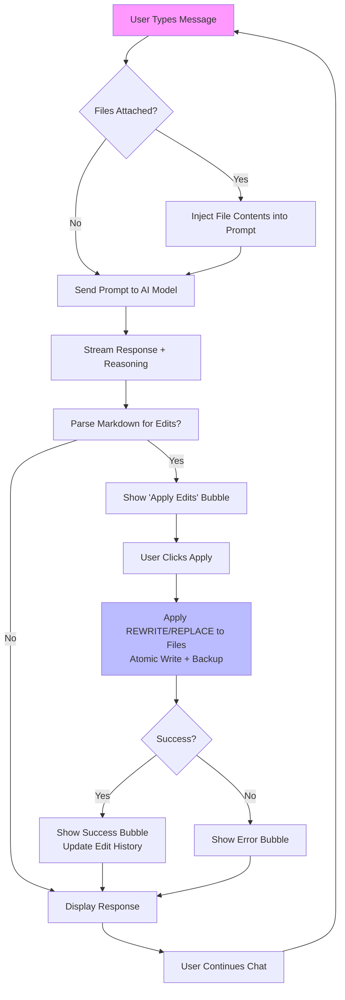

### REWRITE README.md
Creating a new comprehensive README.md from scratch to summarize the AI Chat application's purpose, features, setup, usage, and capabilities. This includes sections for quick overview, detailed features with tables for models and reasoning levels, installation instructions, usage examples, and a Mermaid diagram illustrating the core workflow (chat interaction, file handling, and edit application). The content is structured for clarity, using markdown elements like tables and diagrams where appropriate to present capabilities effectively.

```markdown
# AI Chat Application

A modern, web-based AI chat interface built with [NiceGUI](https://nicegui.io/) and integrated with advanced language models via OpenRouter (or OpenAI). This application supports interactive conversations, file attachments (local or via URL scraping), reasoning-enabled responses, and automatic file editing based on AI-generated markdown directives. It's designed for developers, enabling seamless code review, generation, and modification workflows.

## Features

- **Interactive Chat**: Stream real-time responses from top AI models with optional reasoning traces (e.g., chain-of-thought).
- **File Handling**: Search and attach local files (e.g., code in Python, C++, JS) or scrape web pages into markdown files.
- **Edit Automation**: Parse AI responses for `EDIT` or `REWRITE` directives in markdown format and apply changes atomically to files, with rollback support.
- **UI Enhancements**: Dark theme, copy buttons for code blocks, timers for response duration, undo/clear actions, and keyboard shortcuts.
- **Modes**: Switch between standard chat and "extract" mode (appends a prompt for structured output).
- **Persistence**: Chat state stored in browser tabs; supports SSL for secure deployment.
- **Error Handling**: Robust parsing, notifications for failures (e.g., file not found, edit errors), and safe rollbacks.

### Supported Models
The app integrates with OpenRouter for model access. Here's a table of default supported models:

| Model ID                  | Provider    | Description                          | Strengths                     |
|---------------------------|-------------|--------------------------------------|-------------------------------|
| openai/gpt-5             | OpenAI     | Flagship model (hypothetical/next-gen) | General reasoning, creativity |
| openai/gpt-5-mini        | OpenAI     | Lightweight version                  | Speed, cost-efficiency        |
| anthropic/claude-4.5-sonnet | Anthropic | Advanced conversational AI           | Safety, nuanced responses     |
| x-ai/grok-4-fast         | xAI        | Fast, witty model                    | Humor, quick tasks            |
| openai/gpt-5-pro         | OpenAI     | Pro variant (enhanced capabilities)  | Complex problem-solving       |
| openai/gpt-oss-120b      | OpenAI     | Open-source large model              | Customizable, high capacity   |

*Note*: Set `OPENROUTER_API_KEY` env var for access. OpenAI direct support via `OPENAI_API_KEY` (fallback).

### Reasoning Levels
Control the depth of AI "thinking" before final responses. Higher levels allocate more tokens for reasoning.

| Level    | Token Limit | Use Case                          |
|----------|-------------|-----------------------------------|
| none     | 0          | Direct responses (fastest)        |
| minimal  | 1024       | Basic step-by-step for simple queries |
| low      | 2048       | Light reasoning for code reviews  |
| medium   | 4096       | Balanced for most tasks           |
| high     | 16384      | Deep analysis (e.g., complex edits)|

### File Search and Attachment
- **Local Files**: Searches recursively in project dirs (e.g., code files with whitelisted extensions like `.py`, `.js`, `.md`).
- **URLs**: Paste URLs to scrape HTML content (using BeautifulSoup), clean it, and save as markdown (cached in `~/.cache/ai-chat/web/`).
- **Limits**: Up to 10 search results; attached files are included in prompts.

## Installation

1. **Prerequisites**:
   - Python 3.10+.
   - Install dependencies: `pip install nicegui httpx openai beautifulsoup4`.
   - Set environment variables:
     - `OPENROUTER_API_KEY`: For OpenRouter models (required).
     - `OPENAI_API_KEY`: Optional for direct OpenAI access.
   - For SSL (optional): Generate `cert.pem` and `key.pem` (self-signed or CA-issued).

2. **Project Structure**:
   ```
   .
   ├── app5.py          # Main NiceGUI app
   ├── utils.py         # ChatClient, file utils, edit parser
   ├── stuff.py         # Prompts (e.g., CHAT_PROMPT, EXTRACT_ADD_ON) – add if missing
   ├── README.md        # This file
   ├── cert.pem         # SSL cert (optional)
   └── key.pem          # SSL key (optional)
   ```

3. **Run the App**:
   ```bash
   python app5.py --port 8080
   ```
   - Access at `https://localhost:8080` (SSL enabled if certs present) or `http://localhost:8080`.
   - Dark mode enabled by default; reconnects on disconnect.

## Usage

1. **Start Chatting**:
   - Select a model and reasoning level from the top bar.
   - Type in the textarea (Shift+Enter for new lines; Enter to send).
   - Responses stream in real-time with a timer.

2. **Attach Files**:
   - Search local files in the input field (min 2 chars; use arrows/Enter to select).
   - Paste a URL (e.g., `https://example.com`): It scrapes content into an attached `.md` file.
   - Attached files appear as green bubbles; remove with the close button.
   - Files are injected into the prompt for context-aware responses.

3. **Apply Edits**:
   - Instruct the AI to edit files (e.g., "Fix bugs in app5.py").
   - AI responds with markdown like:
     ```
     ### EDIT app5.py
     Update the send function for better error handling.

     #### REPLACE
     ```python
     try:
         async for chunk in stream:
     ```
     #### WITH
     ```python
     try:
         async for chunk in stream:
             if isinstance(chunk, Exception):
                 raise chunk
     ```
     ```
   - After response, an "Apply edits" bubble appears. Click to apply (atomic writes with backups).
   - Success/error bubbles show changes (e.g., "replaced 1 block(s): 100 → 105 lines").
   - Reject individual edits or use "Back" to undo the last message (rolls back edits).

4. **Advanced Actions**:
   - **Stop**: Halts streaming responses.
   - **Clear**: Resets chat and files.
   - **Undo**: Reverts last user message and its edits.
   - **Copy**: Click copy icons on code blocks.
   - **Mode: Extract**: Appends a prompt for structured/JSON-like output.

### Workflow Diagram
Here's a Mermaid diagram showing the core interaction flow:



## Limitations and Notes

- **Token Limits**: High reasoning + large files may hit API limits (e.g., 50k max tokens per response).
- **Edit Parsing**: Relies on strict markdown format; malformed directives are ignored with errors.
- **Path Resolution**: Edits resolve filenames relative to attached files or common dirs (e.g., `/home/pygmy/code`).
- **Dependencies**: Requires `beautifulsoup4` for URL scraping; install if missing.
- **Security**: Use SSL in production; API keys are env-only (not hardcoded).
- **Customization**: Edit `stuff.py` for custom prompts (e.g., `CHAT_PROMPT` for system instructions).

## Contributing
Fork and PR improvements (e.g., more models, better parsing). Ensure code follows the existing style: concise, modern Python/async.

## License
MIT – feel free to use/modify.